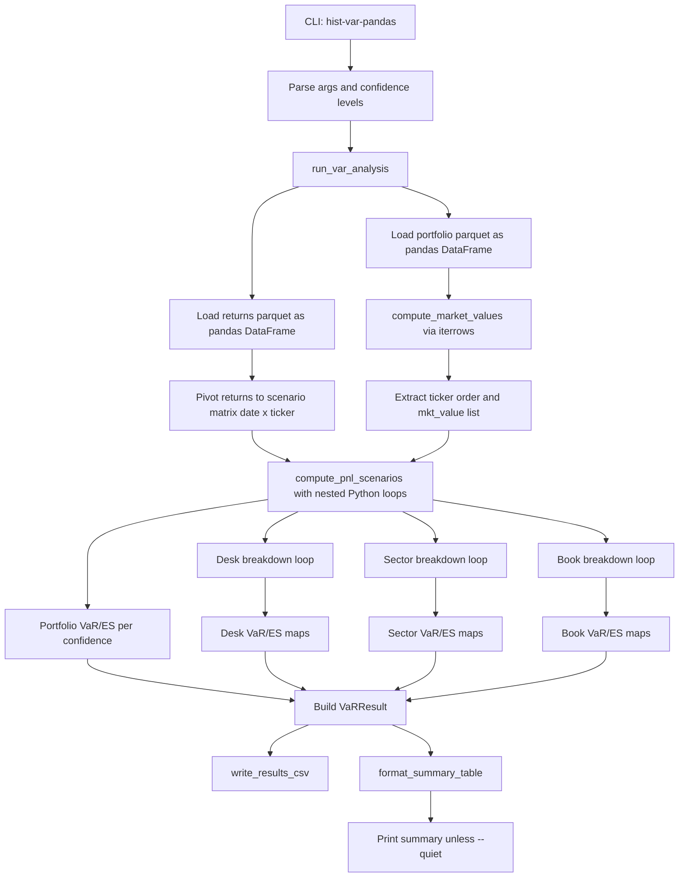
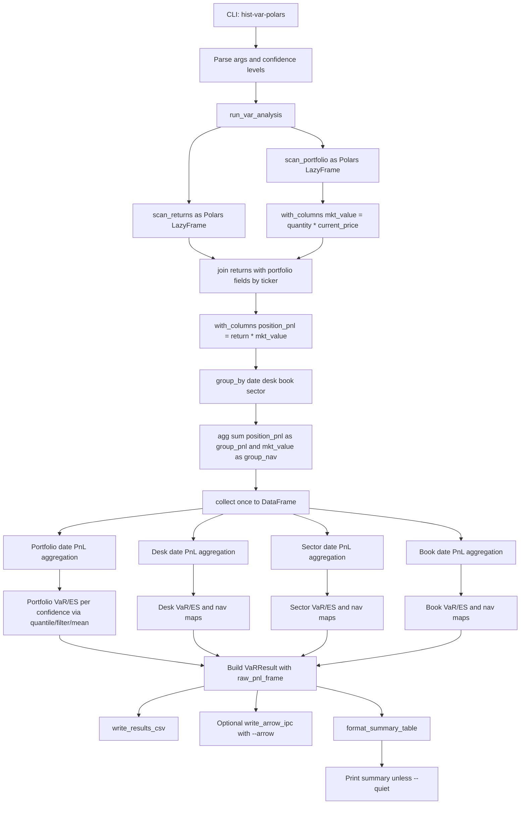

# Historical VaR Flows

This document captures the high-level execution flow for both implementations in this project.

## pandas_var Flow

```mermaid
flowchart TD
    A[CLI: hist-var-pandas] --> B[Parse args and confidence levels]
    B --> C[run_var_analysis]

    C --> D[Load portfolio parquet as pandas DataFrame]
    C --> E[Load returns parquet as pandas DataFrame]

    D --> F[compute_market_values via iterrows]
    E --> G[Pivot returns to scenario matrix date x ticker]
    F --> H[Extract ticker order and mkt_value list]
    G --> I[compute_pnl_scenarios with nested Python loops]
    H --> I

    I --> J[Portfolio VaR/ES per confidence]
    I --> K[Desk breakdown loop]
    I --> L[Sector breakdown loop]
    I --> M[Book breakdown loop]

    K --> N[Desk VaR/ES maps]
    L --> O[Sector VaR/ES maps]
    M --> P[Book VaR/ES maps]

    J --> Q[Build VaRResult]
    N --> Q
    O --> Q
    P --> Q

    Q --> R[write_results_csv]
    Q --> S[format_summary_table]
    S --> T[Print summary unless --quiet]
```

## polars_var Flow

```mermaid
flowchart TD
    A[CLI: hist-var-polars] --> B[Parse args and confidence levels]
    B --> C[run_var_analysis]

    C --> D[scan_portfolio as Polars LazyFrame]
    C --> E[scan_returns as Polars LazyFrame]

    D --> F[with_columns mkt_value = quantity * current_price]
    E --> G[join returns with portfolio fields by ticker]
    F --> G
    G --> H[with_columns position_pnl = return * mkt_value]
    H --> I[group_by date desk book sector]
    I --> J[agg sum position_pnl as group_pnl and mkt_value as group_nav]

    J --> K[collect once to DataFrame]

    K --> L[Portfolio date PnL aggregation]
    K --> M[Desk date PnL aggregation]
    K --> N[Sector date PnL aggregation]
    K --> O[Book date PnL aggregation]

    L --> P[Portfolio VaR/ES per confidence via quantile/filter/mean]
    M --> Q[Desk VaR/ES and nav maps]
    N --> R[Sector VaR/ES and nav maps]
    O --> S[Book VaR/ES and nav maps]

    P --> T[Build VaRResult with raw_pnl_frame]
    Q --> T
    R --> T
    S --> T

    T --> U[write_results_csv]
    T --> V[Optional write_arrow_ipc with --arrow]
    T --> W[format_summary_table]
    W --> X[Print summary unless --quiet]
```
